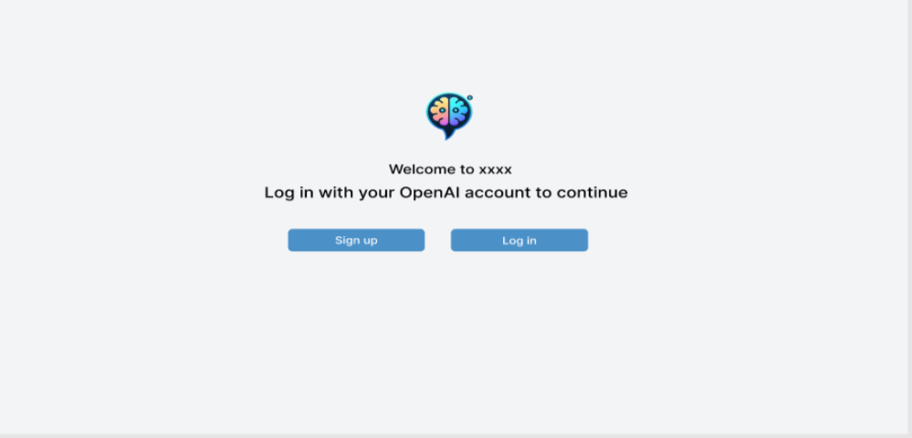
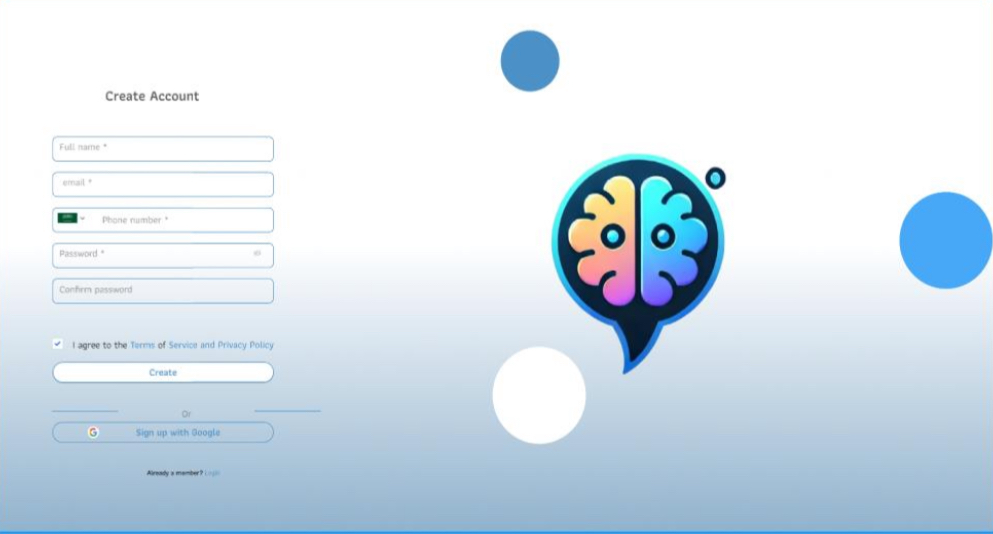
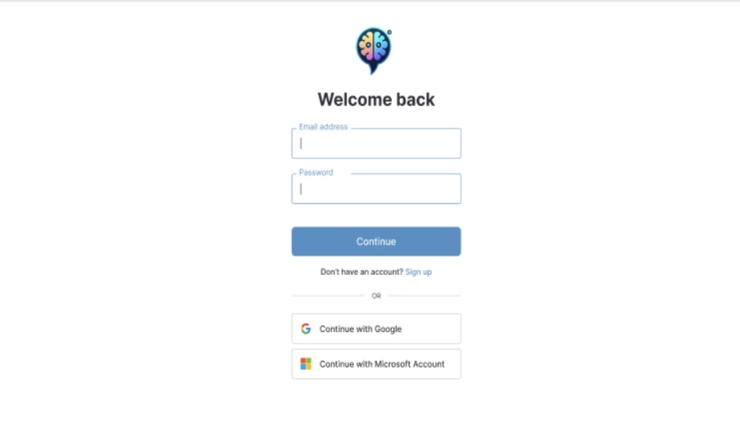
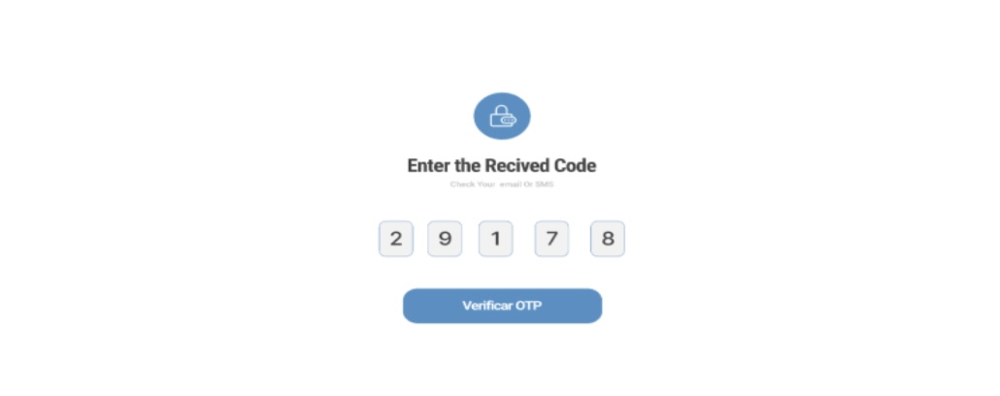
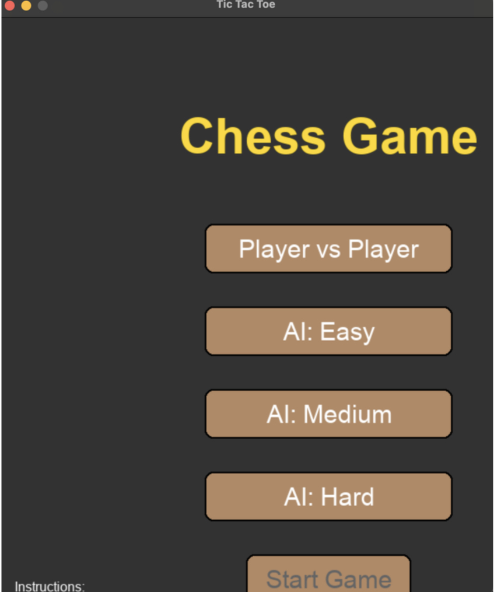
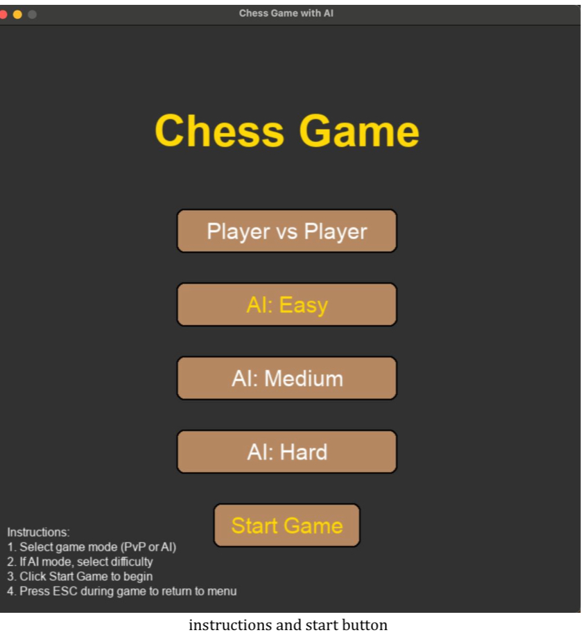
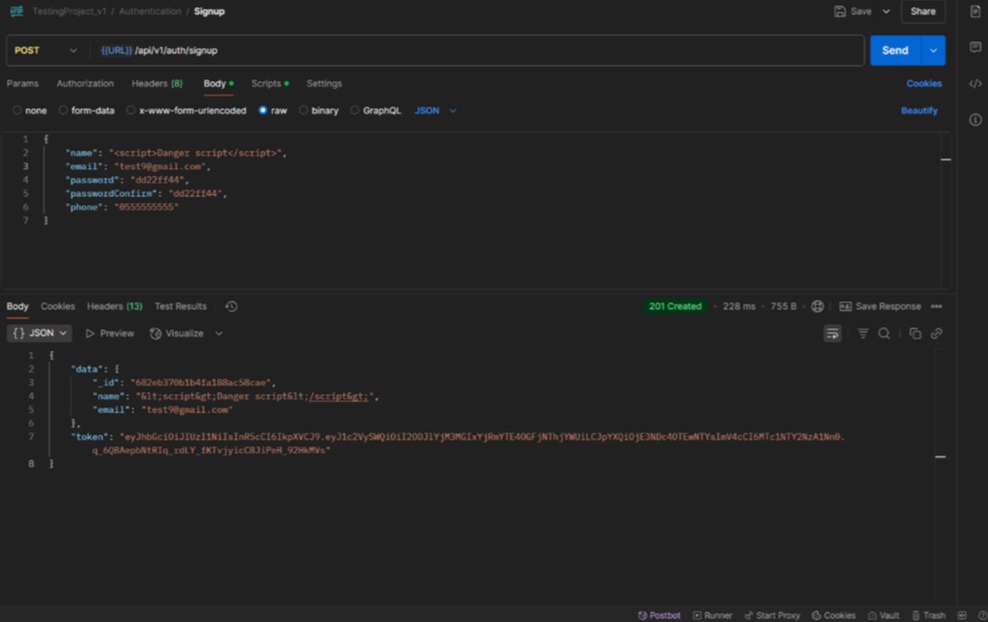
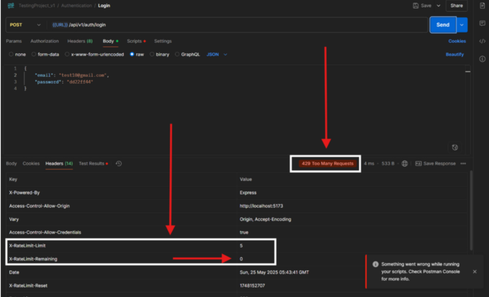

# AI Literacy Companion for Kids

An offline, AI-powered educational platform designed to help children ages 6-12 improve their literacy skills while safely learning about artificial intelligence — no internet connection required.

This was my Senior Graduation Project at the University of Business & Technology (UBT), College of Engineering, developed with a team of 4 under the supervision of Dr. Faisal Arafsha.

## My Role: UI/UX Design

I led the complete UI/UX design of the platform using Figma, designing every interface across the system:

- Authentication flow (Sign Up, Login, OTP verification)
- Main chat interface
- Admin and Teacher dashboards
- Interactive learning games (Tic Tac Toe, Chess, Memory Game)
- About page and navigation

The design focused on being clean, intuitive, and age-appropriate for young children, using a calm color palette (blue, white, and light gray) chosen specifically for trust, clarity, and readability.
## Screens

### Welcome Screen

### Sign Up Screen

### Login Screen

### OTP Verification Screen

### Chess Game — Before Fix

*Layout bug: buttons lacked clear hover/active states.*

### Chess Game — After Fix

*Fixed with clear instructions, active-state highlighting, and a polished start button.*

## What the Platform Includes

- 🤖 An offline AI chatbot with intent classification, conversation memory, and self-learning capabilities
- 📊 Role-based dashboards for students, teachers, and admins
- 🎮 Interactive educational games
- 🔒 Security measures designed with child data privacy in mind (COPPA/GDPR-aligned)

## Security Testing

A dedicated security testing phase was conducted to protect the platform's young users.

### Cross-Site Scripting (XSS) Prevention
Input fields were tested against script injection attempts. Backend sanitization successfully neutralized malicious input before storage.

### Rate Limiting
Authentication routes were tested against high-volume requests. The `express-rate-limit` middleware correctly blocked excess requests.

## Tech Stack

- **Frontend:** React JS, Tailwind CSS
- **Backend:** Node.js, Express.js
- **AI Engine:** Python (PyTorch, TensorFlow, LSTMs)
- **Database:** MongoDB, MySQL
- **Design:** Figma

## Team

This was a team project (4 members) for our Senior Graduation requirement.

My role: UI/UX Design
